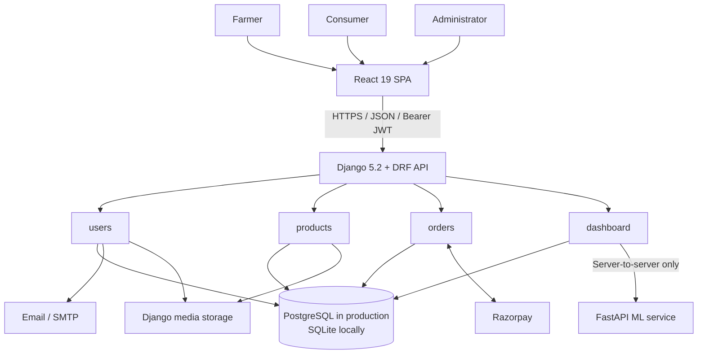

# ನೇಗಿಲುai (NegiluAI) — Complete Project Documentation

**Project type:** Role-based agricultural marketplace with crop-intelligence endpoints  
**Version:** 1.0  
**Primary users:** Farmers, consumers, and administrators  
**Technology:** React + TypeScript, Django REST Framework, FastAPI, PostgreSQL/SQLite, Razorpay

## 1. Project overview

NegiluAI is a digital agricultural marketplace intended to connect farmers directly with consumers. Farmers maintain farm profiles, list produce, manage product images, and fulfil orders. Consumers discover approved listings, save products, maintain a cart, pay for orders, track fulfilment, and leave reviews after delivery. Administrators verify farmer accounts and moderate product listings to support marketplace trust.

The system also includes authenticated crop-intelligence endpoints for yield and price requests. The current prediction service is a transparent **baseline implementation**, not a trained or validated machine-learning model. It must not be presented as an accurate forecasting system until documented datasets, evaluation, and trained models are added.

## 2. Objectives

- Create a direct farm-to-consumer produce marketplace.
- Give farmers control over listings, stock, and order fulfilment.
- Give consumers secure product discovery, cart, payment, and order tracking.
- Establish trust through farmer verification and listing moderation.
- Prevent overselling through transactional stock reservation.
- Keep payments server-verified using Razorpay signatures and webhooks.
- Provide a replaceable internal foundation for future crop analytics.

## 3. User roles and capabilities

| Role | Main capabilities |
| --- | --- |
| Farmer | Register, complete farm profile, receive verification, create and manage listings, upload images, see dashboard and sales, and progress eligible orders through fulfilment. |
| Consumer | Register, browse approved products, filter/search listings, save products, manage cart, checkout, pay, view orders, and review delivered purchases. |
| Administrator | View platform statistics, view users, verify farmers, and approve, reject, or return listings to pending review. |

The frontend uses route guards for a clearer user experience. Django repeats role, ownership, and verification enforcement at the API layer, which remains the source of truth.

## 4. System architecture



### Architectural principles

- The browser calls Django only; it never calls the FastAPI service directly.
- Django owns validation, permissions, payment verification, transactions, and persistent data.
- The React single-page application is responsible for presentation and client-side session handling.
- The ML service is independently deployable so a real model can later replace the baseline without changing the browser contract.
- Configuration and secrets are supplied through environment variables rather than committed frontend code.

## 5. Technology stack

| Layer | Technology | Purpose |
| --- | --- | --- |
| Frontend | React 19, TypeScript, Vite 8 | Responsive single-page application |
| Styling/UI | Tailwind CSS v4, Motion, Lucide React, Recharts | Styling, animation, icons, and charts |
| Backend | Django 5.2, Django REST Framework | REST API, business rules, ORM, admin |
| Authentication | SimpleJWT | Bearer access and refresh tokens |
| Data | PostgreSQL (production), SQLite (local fallback) | Persistent marketplace records |
| Media | Pillow + Django media storage | Product and farmer profile images |
| Payments | Razorpay Python SDK | Payment order creation, signature verification, webhooks |
| API documentation | drf-spectacular | OpenAPI schema and Swagger UI |
| ML service | FastAPI, Pydantic, Uvicorn | Internal baseline prediction endpoints |

## 6. Repository structure

```text
agritrade/
├── frontend/                 React client
│   └── src/
│       ├── pages/            Marketplace and role-specific screens
│       ├── auth/             Session context
│       ├── routes/           Protected and role routes
│       ├── api.ts            Typed application API wrapper
│       └── api/client.ts     HTTP client and token handling
├── backend/                  Django project
│   ├── config/               Settings and top-level URLs
│   ├── users/                Identity, profiles, password reset
│   ├── products/             Listings, images, wishlist, reviews
│   ├── orders/               Cart, checkout, payment, fulfilment
│   └── dashboard/            Role dashboards and ML proxy
├── ml-service/               Internal FastAPI baseline service
└── docs/                     API, deployment, technical, and project docs
```

`backend/legacy-backend-archive/` is archived code and is not the active Django application.

## 7. Main functional workflows

### 7.1 Registration, sign-in, and profile

1. A farmer or consumer registers with username, email, password, and role.
2. Login returns JWT access and refresh tokens.
3. The frontend stores the normalized session in browser local storage and attaches the access token to later API calls.
4. The profile endpoint supplies or updates the core user details; farmer accounts also have a `FarmerProfile`.
5. A password reset uses an emailed one-time code, then a short-lived reset token.

### 7.2 Farmer verification and product moderation

1. A farmer completes their profile.
2. An administrator marks the farmer as verified.
3. A verified farmer creates a listing; it begins with `pending` approval.
4. An administrator approves, rejects, or returns the product to pending status.
5. Public discovery exposes approved listings; farmers can still see their own moderation state.

### 7.3 Consumer purchase and payment

1. A consumer searches or filters approved products and optionally adds products to a wishlist.
2. Cart items record the chosen product and quantity.
3. Checkout validates the cart in one database transaction, locks relevant product rows, confirms available stock, creates an order, reduces stock, and reserves it for 15 minutes.
4. The backend creates or reuses a Razorpay payment order.
5. Razorpay checkout data is signature-verified by Django. Signed Razorpay webhooks are also processed as the authoritative external confirmation path.
6. Payment success confirms the order. Cancellation, failure, or reservation expiry returns stock exactly once.

### 7.4 Fulfilment and reviews

1. An eligible farmer sees fulfilment data only for products they own.
2. A farmer owning every item in a paid order can move it through `confirmed → processing → shipped → delivered`.
3. Shipping requires a courier name and tracking ID; shipping and delivery timestamps are recorded.
4. A consumer may create or update one review per product only after having a delivered purchase.

### 7.5 Prediction requests

1. A signed-in user sends a yield or price request to Django.
2. Django validates the request and calls the internal FastAPI service with a short timeout.
3. Django returns the normalized response to the frontend, or a `502`/`503` error if the service response is invalid/unavailable.

The baseline yield result is area × supplied historical yield (or 1 tonne/hectare when omitted). The baseline price result is deliberately `0.0 INR per kg`; it is a placeholder, not a market forecast.

## 8. Core data model

| Entity | Description |
| --- | --- |
| `User` | Custom Django user with `farmer`, `consumer`, or `admin` role. |
| `FarmerProfile` | One-to-one farmer extension: farm, contact, location, certifications, verification, picture, and bio. |
| `PasswordResetCode` | Hashed, expiring, single-use reset-code records. |
| `Product` | Farmer listing with category, price, quantity, unit, availability, location, and moderation state. |
| `ProductImage` | Listing image records; database constraint allows only one primary image per product. |
| `Wishlist` | Unique saved product per user/product pair. |
| `Review` | Unique user/product review with rating and comment. |
| `Cart` / `CartItem` | One cart per user and unique product item within a cart. |
| `Order` / `OrderItem` | Checkout snapshot, delivery address, total, fulfilment state, stock reservation, and item prices/quantities. |
| `Payment` | One payment record per order with Razorpay references and payment state. |
| `PaymentWebhookEvent` | Deduplicated audit record of Razorpay webhook deliveries. |

### Important relationships

- A farmer user has one optional farmer profile and many products.
- A product has many images, reviews, cart items, wishlist records, and order items.
- A consumer has one cart and many orders.
- An order contains one or more order items and one payment record.

## 9. API summary

Development API base URL: `http://127.0.0.1:8000/api`

| Area | Key endpoints |
| --- | --- |
| Authentication | `POST /register/`, `POST /login/`, `GET/PATCH /profile/`, `POST /token/refresh/`, password-reset endpoints |
| Products | `GET/POST /products/`, `GET/PATCH/DELETE /products/{id}/`, image and review actions |
| Wishlist | `GET /wishlist/`, `POST /wishlist/toggle/` |
| Cart/orders | `/carts/current/`, `/cart-items/`, `/carts/checkout/`, `/orders/`, Razorpay payment and cancellation actions |
| Fulfilment | `/farmer/order-items/`, `/farmer/orders/{id}/transition/` |
| Dashboards | `/dashboard/farmer/*`, `/dashboard/consumer/overview/`, `/dashboard/admin/*` |
| Predictions | `POST /predictions/yield/`, `POST /predictions/price/` |
| Documentation | `GET /schema/`, `GET /docs/` |

Protected endpoints require `Authorization: Bearer <access-token>`. JSON is used for request/response bodies except product image uploads, which use `multipart/form-data`. The full endpoint contract is in [API.md](API.md).

## 10. Local setup and running the project

### Prerequisites

- Node.js and npm or pnpm
- Python 3.11+ recommended
- PostgreSQL for production-like local development (optional; SQLite works by default)
- A Razorpay test account if payment testing is required

### 1. Start the backend

```powershell
cd backend
python -m venv .venv
.\.venv\Scripts\Activate.ps1
pip install -r requirements.txt
python manage.py migrate
python manage.py runserver
```

The API starts at `http://127.0.0.1:8000`.

### 2. Start the ML service

```powershell
cd ml-service
python -m venv .venv
.\.venv\Scripts\Activate.ps1
pip install -r requirements.txt
uvicorn main:app --host 127.0.0.1 --port 8001 --reload
```

Check it at `http://127.0.0.1:8001/health`.

### 3. Start the frontend

```powershell
cd frontend
npm install
npm run dev
```

The frontend defaults to `http://127.0.0.1:8000/api`. To use another API URL, set `VITE_API_BASE_URL` before building or starting Vite.

## 11. Configuration

The backend reads the following environment variables:

| Variable | Purpose | Local default/behaviour |
| --- | --- | --- |
| `DJANGO_SECRET_KEY` | Django secret key | Development-only fallback is present; replace in deployment. |
| `DJANGO_DEBUG` | Enables Django debug mode | `False` |
| `DJANGO_ALLOWED_HOSTS` | Comma-separated allowed hosts | `127.0.0.1,localhost` |
| `POSTGRES_DB`, `POSTGRES_USER`, `POSTGRES_PASSWORD`, `POSTGRES_HOST`, `POSTGRES_PORT` | PostgreSQL connection | If all are absent, SQLite is used. |
| `CORS_ALLOWED_ORIGINS` | Allowed browser origins | Local Vite origins. |
| `RAZORPAY_KEY_ID`, `RAZORPAY_KEY_SECRET` | Razorpay API credentials | Required for live payment creation. |
| `RAZORPAY_WEBHOOK_SECRET` | Webhook signature validation | Required for trusted Razorpay webhooks. |
| `ML_SERVICE_URL` | Internal FastAPI base URL | `http://127.0.0.1:8001` |
| `ML_SERVICE_TIMEOUT_SECONDS` | ML request timeout | `5` seconds |
| `EMAIL_*`, `DEFAULT_FROM_EMAIL` | SMTP reset-email configuration | Console email backend in debug; SMTP otherwise. |
| `DJANGO_SECURE_SSL` | Enables HTTPS redirects/cookies/HSTS settings | `False` |

## 12. Security and integrity controls

- JWT authentication protects signed-in functionality; access tokens have a 60-minute lifetime.
- Django password validators are enabled.
- API authorization uses role checks, verified-farmer checks, and ownership checks.
- Password-reset codes are hashed, expire after 10 minutes, are single use, permit at most five attempts, and are rate limited.
- Product approval protects public discovery; farmer verification protects listing creation.
- Checkout runs inside a database transaction with row locks to reduce concurrent overselling.
- Pending reservations expire after 15 minutes and stock release is idempotent.
- Razorpay signatures and signed webhooks protect payment status; webhook event IDs are deduplicated.
- CORS is allow-list based, not universally open.
- Production HTTPS settings include secure cookies, HSTS, content-type protection, referrer policy, and clickjacking protection when `DJANGO_SECURE_SSL=true`.

## 13. Operations, testing, and maintenance

### Reservation maintenance

Run the following periodically in production, normally every five minutes:

```powershell
python manage.py release_expired_reservations
```

It restores stock only for expired pending reservations and can safely run more than once.

### Tests and build checks

```powershell
# Django tests
cd backend
python manage.py test

# Frontend production build
cd frontend
npm run build
```

Use the generated Swagger UI at `/api/docs/` to inspect the running API. Deployment guidance, including scheduler examples, is available in [DEPLOYMENT.md](DEPLOYMENT.md).

## 14. Current limitations and future enhancements

1. The FastAPI yield/price logic is baseline-only and requires real, documented agricultural datasets, model training, validation metrics, and monitoring before it can make forecasting claims.
2. Email delivery depends on SMTP variables in production; verify sender authentication and deliverability before launch.
3. Product/media storage is local Django media storage in this repository. Production should use durable object storage and a CDN.
4. Add automated frontend tests, API contract tests, end-to-end payment sandbox tests, and CI/CD checks for stronger release confidence.
5. Add payment reconciliation dashboards, refund workflows, notifications, delivery-partner integration, audit logging, and observability/alerting for a production rollout.
6. Confirm legal, tax, privacy, seller-verification, and food-safety requirements for every target geography before accepting live transactions.

## 15. Related documentation

- [Technical Documentation](TECHNICAL_DOCUMENTATION.md) — deeper architecture, methodology, DFD, and control-flow material.
- [API Contract](API.md) — endpoint-level request/access details.
- [Deployment Guide](DEPLOYMENT.md) — configuration and deployment procedures.
- [ML Service README](../ml-service/README.md) — baseline service behaviour and local requests.

